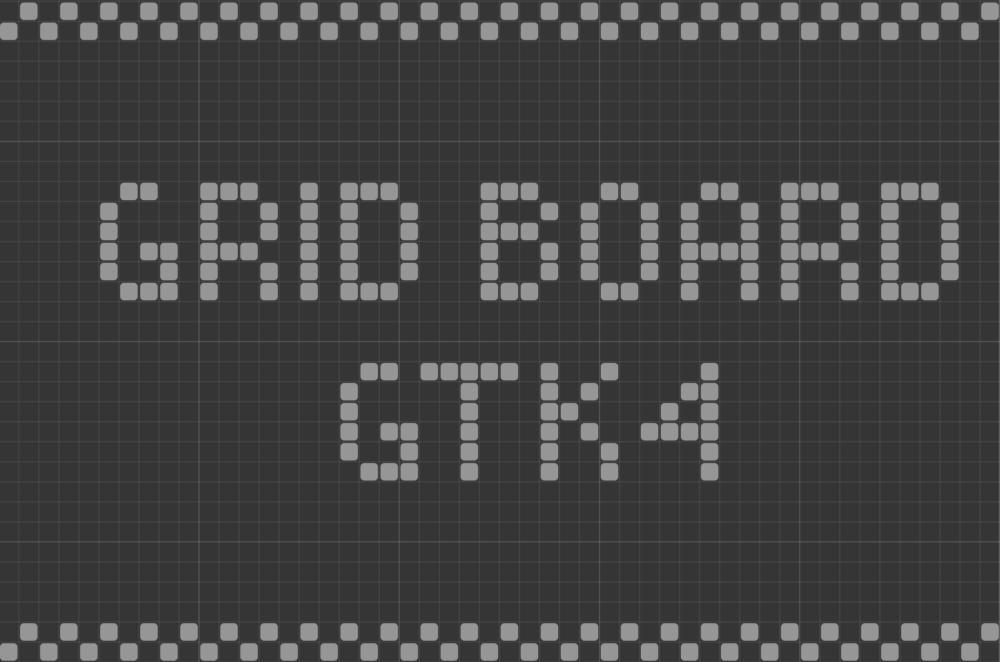

# gtk-grid-board

Simple grid board widget for gtk4.
Some thigns that can be customized:

- number of rows and columns (of course)
- cell radius
- cell spacing (between cells)
- colors (cell, grid, background)
- turn on/off guide lines (and accent lines)

**CSS**
.grid-board
#guidelines
#cells




## Requirements

- C11 compiler
- meson
- gtk4
- git

## Build

clone and cd into the directory

```bash
meson setup build
cd build
meson compile
```

#### Test

```bash
meson test --verbose
```

## Install

```bash
meson install
```

## Uninstall

```bash
ninja uninstall
```

## Usage

**Meson**

```meson
gnt_dep = dependency('gnt-0.1')
e = executable(
...
dependencies: [gnt_dep],
...
)
```

**Cmake**

```cmake
find_package(PkgConfig REQUIRED)
pkg_search_module(gnt REQUIRED IMPORTED_TARGET gnt-0.1>=0.1)

target_link_libraries(... PkgConfig::gnt)
```

**C/C++**
It's used like any other gtk widget, just include the header (ggb.h) and create an instance of the widget (GgbGrid). You can take a look at the test file in the root directory.

**Python**

Python bindings are available and installed by default, there is an example in the `examples` directory.

**Note:** At the moment there is no stubs generated, but the api is almost the same as the C api (just look at the header file).
